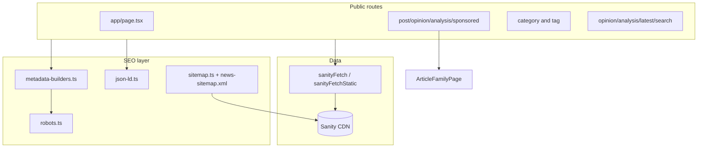

# Lighthouse + SEO Performance Audit

**Date:** 2026-05-27  
**Scope:** Next.js 16 App Router news site (`app/`), Sanity CMS, public routes + indexing infrastructure  
**Method:** Static code review + local production build (`npx next build`) + Lighthouse CLI on `http://localhost:3001`  
**Related:** [Image rendering audit](./image-rendering-state.md)

---

## Executive summary

This codebase has a **solid SEO foundation** for a news product: centralized metadata builders, article-level JSON-LD (`NewsArticle` / `Article`), Google News sitemap route, robots helpers for sponsored/utility pages, and ISR-style revalidation (60s) on most editorial routes.

**Lighthouse (local production, mobile unless noted)** shows the main performance gap is **LCP on image-heavy surfaces**, not missing meta tags in HTML:

| Route | Perf | SEO | A11y | LCP (mobile) |
|-------|------|-----|------|----------------|
| Homepage | 66 | 100 | 92 | 5.4s |
| Homepage (desktop) | 96 | 100 | 92 | 1.1s |
| Article (`/post/...`) | 67 | 92* | 92 | **11.4s** |
| Category | 71 | 100 | 92 | 3.8s |
| Tag | 72 | 100 | 92 | 5.6s |
| Opinion index | 90 | 100 | 90 | 3.6s |
| Analysis index | 90 | 100 | 90 | 3.6s |
| Search (`?q=news`) | 80 | 69** | 91 | 5.4s |

\* Article SEO 92: Lighthouse flagged `meta-description` even though `curl` shows a valid `<meta name="description">` in the rendered HTML (likely audit timing / streaming metadata quirk—verify in Search Console).  
\** Search SEO 69: expected `is-crawlable` failure due to intentional `noindex` (`robotsUtilityNoindex`).

**Top blockers to Lighthouse Performance:** hero/cover images via `/_next/image` + Unsplash URLs (large transfer, mobile throttling), global client shell (header, auth providers, ticker), article route **on-demand** rendering (`ƒ /post/[slug]`) vs SSG for opinion/analysis, client-side cover preload (`PreloadCoverImage`), and high TBT on category/tag from header JS.

**Top blockers to SEO trust:** article page GROQ **does not enforce** `ARTICLE_FAMILY_PUBLISHED`; draft preview lacks `noindex`; `robots.txt` allows `/studio` and account routes; empty **news sitemap** when no posts published in last 48h; canonical/OG URLs use `NEXT_PUBLIC_SITE_URL` (observed `localhost:3000` in HTML while server ran on `3001`).

---

## Measurement setup

### Environment

- **Build:** `npm run typegen && npx next build` (skipped `prebuild` `format`—it fails on `.open-next/` artifacts; see [Verification](#verification-results))
- **Server:** `PORT=3001 npm run start` (port 3000 was already in use)
- **Lighthouse:** `npx lighthouse` (CLI not globally installed; used via `npx`)
- **Reports:** `docs/audits/lighthouse-reports/*.json`

### Commands to reproduce

```bash
# Install CLI (optional)
npm install -g lighthouse

# Production build (avoid prebuild format on .open-next)
npm run typegen && npx next build

# Start server
PORT=3001 npm run start

# Example audit
npx lighthouse http://localhost:3001/ \
  --chrome-flags="--headless=new --no-sandbox" \
  --only-categories=performance,seo,accessibility \
  --form-factor=mobile --screenEmulation.mobile=true \
  --output=json --output-path=docs/audits/lighthouse-reports/home-mobile.json
```

### Sample URLs audited

| Page | URL |
|------|-----|
| Homepage | `/` |
| Article | `/post/cyber-agencies-flag-vpn-supply-chain-exposure-after-vendor-patch-delays` |
| Category | `/category/business` |
| Tag | `/tag/artificial-intelligence` |
| Opinion | `/opinion` |
| Analysis | `/analysis` |
| Search | `/search?q=news` |

---

## Current suspected Lighthouse blockers

### Performance (measured + code)

1. **LCP element = hero/cover `next/image`** (Unsplash via `/_next/image`, `fetchpriority="high"` on homepage center column and article cover). Mobile LCP 5.4s (home), **11.4s (article)**. Desktop home LCP 1.1s.
2. **Image delivery:** Lighthouse “Improve image delivery” cites ~40–53 KiB waste per hero on mobile (format/size vs displayed dimensions).
3. **Total Blocking Time:** Home mobile 450ms; category 730ms; article 300ms—consistent with global `HeaderClient` (ResizeObserver, scroll listeners), `NewsTickerTrack`, `SupabaseAuthProvider`, `SessionProviderWrapper`, and Radix menu primitives.
4. **`/post/[slug]` is dynamic (`ƒ`)** in build output—not pre-rendered as SSG like `opinion/[slug]` and `analysis/[slug]` (`●`), despite `generateStaticParams` in [`app/post/[slug]/page.tsx`](../app/post/[slug]/page.tsx). Hurts TTFB consistency for the primary SEO surface.
5. **Client cover preload** in [`app/components/PostPage/PreloadCoverImage.tsx`](../app/components/PostPage/PreloadCoverImage.tsx) runs in `useEffect`—too late for LCP; duplicates `priority` on `ImageRenderer`.
6. **Homepage data fan-out:** 10+ parallel `sanityFetchStatic` calls in [`app/page.tsx`](../app/page.tsx) before HTML.
7. **Cover gallery carousel** mounts all slides ([`CoverImageCarousel.tsx`](../app/components/PostPage/PostBody/CoverImageCarousel.tsx))—bandwidth on multi-image articles.
8. **Fonts:** Libre Franklin + Newsreader with `preload: false` in [`app/layout.tsx`](../app/layout.tsx).

### SEO (measured + code)

1. **Search `noindex`** → Lighthouse `is-crawlable` fails (by design).
2. **Article `meta-description` audit** inconsistent with live HTML (see executive summary).
3. **`NEXT_PUBLIC_SITE_URL` mismatch:** OG/canonical/sitemap locs use `http://localhost:3000` while audits hit `3001`—production must set the real origin.
4. **Empty news sitemap** at audit time (no `post`/`analysis` with `publishedAt` in last 48h in CMS).
5. **Structured data:** Lighthouse `structured-data` audit null on article sample—manual JSON-LD present in page; validate in [Rich Results Test](https://search.google.com/test/rich-results).

### Accessibility (Lighthouse-relevant)

- Scores 90–92 across routes; no critical failures blocking SEO category.
- See [image audit](./image-rendering-state.md) for editorial alt/credit gaps on listings.

---

## Route-by-route SEO checklist

| Route | File(s) | Title | Meta description | Canonical | OG | Twitter | Robots | JSON-LD | Notes |
|-------|---------|-------|------------------|-----------|----|---------|--------|---------|-------|
| **Home** | [`app/page.tsx`](../app/page.tsx), [`buildHomepageMetadata`](../app/lib/seo/metadata-builders.ts), [`app/layout.tsx`](../app/layout.tsx) | Yes (site name) | Yes | Yes `/` | Partial (from layout merge; no dedicated OG image on homepage builder) | `summary` card (layout) | index | `WebSite` + publisher on page | Homepage builder lacks explicit `openGraph.images` |
| **Post** | [`app/post/[slug]/page.tsx`](../app/post/[slug]/page.tsx), [`buildArticlePageMetadata`](../app/lib/seo/metadata-builders.ts) | Yes | Yes* | Yes | Yes `article` | `summary_large_image` | index | `NewsArticle` + `BreadcrumbList` | `?id=` only in hrefs, canonical clean |
| **Opinion** | [`app/opinion/[slug]/page.tsx`](../app/opinion/[slug]/page.tsx) | Yes | Yes | Yes | Yes | Yes | index | `Article` + breadcrumb | Not in news sitemap |
| **Analysis** | [`app/analysis/[slug]/page.tsx`](../app/analysis/[slug]/page.tsx) | Yes | Yes | Yes | Yes | Yes | index | `NewsArticle` + breadcrumb | In news sitemap (48h window) |
| **Sponsored** | [`app/sponsored/[slug]/page.tsx`](../app/sponsored/[slug]/page.tsx) | Yes | Yes | Yes | Yes | Yes | **noindex, follow** | `Article` | Correct for paid content |
| **Category** | [`app/category/[slug]/page.tsx`](../app/category/[slug]/page.tsx) | Yes | Yes | Yes | Yes | Yes | index if results | `BreadcrumbList` only | No pagination metadata |
| **Tag** | [`app/tag/[slug]/page.tsx`](../app/tag/[slug]/page.tsx) | Yes | Yes | Yes | Yes | Yes | index if results | `BreadcrumbList` | |
| **Opinion index** | [`app/opinion/page.tsx`](../app/opinion/page.tsx) | Yes | Yes | Yes (+ `?page=`) | Yes | Yes | page 1 index | `BreadcrumbList` | |
| **Analysis index** | [`app/analysis/page.tsx`](../app/analysis/page.tsx) | Yes | Yes | Yes | Yes | Yes | page 1 index | `BreadcrumbList` | |
| **Latest** | [`app/latest/page.tsx`](../app/latest/page.tsx) | Yes | Yes | Yes | Yes | Yes | **noindex** | — | Utility feed |
| **Search** | [`app/search/page.tsx`](../app/search/page.tsx) | Yes (query-aware) | Yes | Yes | Yes | Yes | **noindex** | — | Results client-only |
| **Company / pricing / signin** | `app/company/*`, `app/pricing`, `app/signin` | Root template only | Root only | No | Layout OG image only | No | Default index | — | Thin SEO |
| **Myprofile / studio** | `app/myprofile/*`, `app/(sanity)/studio` | Partial / Studio title | — | — | — | — | **Allowed in robots.txt** | — | Should disallow studio |
| **Author archive** | — | **Missing** | **Missing** | — | — | — | — | Person without `url` | No `/author/[slug]` route |

---

## Route-by-route performance checklist

| Route | Rendering | Revalidate | LCP risk | Client JS | Images | Notes |
|-------|-----------|------------|----------|-------------|--------|-------|
| **Home** | Static `○` | 60s (fetch) | **High** (center hero) | Ticker track, left column carousel, dynamic below-fold sections | `priority` hero in [`centerColumnLanding.tsx`](../app/components/Landing/FirstSection/centerColumnLanding.tsx) | Many Sanity queries |
| **Post** | **Dynamic `ƒ`** | 60s | **Very high** (11.4s mobile) | View trackers, preload client, share/bookmark | Cover `priority` + carousel | Primary SEO URL |
| **Category** | SSG `●` | 60s | Medium (FeatureHero `priority`) | Category trackers | Missing `sizes` on some thumbs | TBT 730ms mobile |
| **Tag** | SSG `●` | 60s | Medium–high | TagViewTracker, ShowMore | Featured `priority` | |
| **Opinion / Analysis index** | Dynamic `ƒ` | 60s | Medium | Index pagination UI | Card grid | |
| **Search** | Server shell + **client results** | — | Medium | Full [`SearchResults.tsx`](../app/search/SearchResults.tsx) | Card thumbs | noindex |
| **Studio** | Dynamic, client-only Studio | force-dynamic | N/A (auth) | **Sanity Studio chunk** | N/A | Isolated layout; not in public nav bundle ideally |

---

## NewsArticle structured data assessment

**Implementation:** [`app/lib/seo/json-ld.ts`](../app/lib/seo/json-ld.ts), wired from [`ArticleFamilyPage.tsx`](../app/components/article-family/ArticleFamilyPage.tsx) via [`buildArticlePageJsonLd`](../app/lib/article-family/structured-data.ts).

| Field | Status | Notes |
|-------|--------|-------|
| `@type` | `NewsArticle` for `post`, `analysis`; `Article` for `opinion`, `sponsored` | Opinion excluded from Google News sitemap by design |
| `headline` | Yes | From `article.title` |
| `description` | Optional | From excerpt; may be empty |
| `datePublished` / `dateModified` | Yes | ISO strings from Sanity |
| `author` | `Person` name only | No `url` (no author pages) |
| `publisher` | `Organization` + optional `logo` | From site settings OG image |
| `image` | Array of URL strings | Made absolute in `toAbsoluteImage`; no `width`/`height` `ImageObject` |
| `mainEntityOfPage` | `WebPage` `@id` | Matches canonical path |
| `articleSection` | Category title when set | |
| `keywords` | Comma-joined tag titles | |
| **BreadcrumbList** | Yes | Per-type paths in `getArticleBreadcrumbItems` |
| **WebSite** (home) | Yes | No `SearchAction` / `potentialAction` |
| **Standalone Organization** | No | Only nested in publisher |

**Gaps vs Google rich-result best practices:** add `ImageObject` dimensions for hero; consider `NewsMediaOrganization` for publisher; author `url` when author archives exist; validate in Rich Results Test after deploy.

---

## Image optimization assessment

Cross-reference: [image-rendering-state.md](./image-rendering-state.md).

| Topic | Finding |
|-------|---------|
| **LCP images** | Homepage + article LCP = `ImageRenderer` → `next/image` → Unsplash (`images.unsplash.com` in [`lib/editorial-image/policy.ts`](../lib/editorial-image/policy.ts)) |
| **Config** | AVIF/WebP, 1y cache on `/_next/image` in [`next.config.ts`](../next.config.ts) |
| **Wikimedia** | Forced `unoptimized` (rate limits)—correct |
| **Non-whitelisted hosts** | `unoptimized` or blocked—impacts LCP if editors use wire URLs |
| **`sizes` / `priority`** | Strong on homepage hero and article cover; weak on many listing thumbs |
| **Preload** | Client-only [`PreloadCoverImage.tsx`](../app/components/PostPage/PreloadCoverImage.tsx)—ineffective for LCP |
| **Blur placeholders** | None |

Lighthouse measured hero ~100 KiB+ through `/_next/image` on mobile with ~40 KiB “wasted” bytes per cover.

---

## Bundle / performance risk assessment

Next.js 16 build output **does not print First Load JS per route** in the terminal. Observed artifacts:

| Signal | Value / note |
|--------|----------------|
| Total client chunks dir | ~8.9 MB under `.next/static/chunks` (hashed Turbopack output) |
| Largest single chunk | ~4.1 MB (`0~f6tat.0rvwk.js`)—shared/vendor graph |
| Homepage server page | `page.js` ~1.4 KB (RSC shell); client manifest ~62 KB |
| **Studio route** | `ƒ /studio/[[...tool]]`—Sanity loaded via `dynamic(..., { ssr: false })` in [`StudioClient.tsx`](../app/(sanity)/studio/[[...tool]]/StudioClient.tsx); separate `(sanity)` layout avoids site chrome |
| **Global client boundaries** | ~45+ `"use client"` files under `app/` including [`SiteShellFrame`](../app/components/layout/site-shell/site-shell-frame.tsx), [`HeaderClient`](../app/components/layout/navbar/header-client.tsx), auth providers in root [`layout.tsx`](../app/layout.tsx) |
| **Sanity on public pages** | Data via server `sanityFetch` / `sanityFetchStatic`; Studio packages should not load on `/` (verify with bundle analyzer in follow-up) |

**Duplication / centralization:** image host policy split between [`sanity/lib/utils.ts`](../sanity/lib/utils.ts) and [`PostBody/media-utils.ts`](../app/components/PostPage/PostBody/media-utils.ts)—see image audit.

---

## Indexing / sitemap / robots assessment

| Asset | File | Assessment |
|-------|------|------------|
| **Sitemap** | [`app/sitemap.ts`](../app/sitemap.ts) | Home, opinion/analysis indexes (conditional), all published `post`/`opinion`/`analysis`, categories/tags with content. Uses `ARTICLE_FAMILY_PUBLISHED`. |
| **News sitemap** | [`app/news-sitemap.xml/route.ts`](../app/news-sitemap.xml/route.ts) | Last 48h, **`post` + `analysis` only** (no opinion). **Empty at audit time**—valid XML, zero URLs. |
| **robots.txt** | [`app/robots.ts`](../app/robots.ts) | `Allow: /` for all agents; points to sitemap + news-sitemap. **Does not disallow** `/studio`, `/api/`, `/myprofile`, `/logineditor`. |
| **Draft / preview** | [`sanity/lib/fetch.ts`](../sanity/lib/fetch.ts), [`app/layout.tsx`](../app/layout.tsx) | Draft mode fetches unpublished; **no `noindex` in metadata** when preview banner shown |
| **Article fetch** | [`articleFamilyPageBySlugQuery`](../sanity/lib/article-family-queries.ts) | **No `ARTICLE_FAMILY_PUBLISHED` filter**—scheduled/draft `status` documents with a slug may render if returned by API |
| **Sponsored** | metadata + robots | `noindex, follow`—good |
| **RSS** | — | **Not implemented** |
| **Author URLs** | — | **Not implemented** |

**Canonical / `?id=` behavior:** [`articleFamilyHref`](../app/lib/article-family/routes.ts) adds `?id=` for duplicate post slugs; canonical in metadata uses path-only [`articleFamilyCanonicalHref`](../app/lib/article-family/routes.ts)—correct for consolidating signals.

---

## Architecture (reference)



---

## Prioritized action plan

### P0 — High impact / likely Lighthouse + SEO lift

#### P0-1 Enforce published guard on article page queries

- **Problem:** [`articleFamilyPageBySlugQuery`](../sanity/lib/article-family-queries.ts) and [`articleFamilyPageByIdQuery`](../sanity/lib/article-family-queries.ts) omit `ARTICLE_FAMILY_PUBLISHED`; unpublished/scheduled content may be reachable.
- **Why it matters:** Accidental indexing of non-news content; trust and legal exposure for a newsroom.
- **Files:** [`sanity/lib/article-family-queries.ts`](../sanity/lib/article-family-queries.ts), [`app/lib/article-family/fetch.ts`](../app/lib/article-family/fetch.ts), slug route pages under `app/post|opinion|analysis|sponsored/[slug]/`
- **Approach:** Add `${ARTICLE_FAMILY_PUBLISHED}` to filters; `notFound()` when null.
- **Lighthouse impact:** SEO (indirect)
- **Risk:** Low

#### P0-2 Server-side LCP preload (remove late client preload)

- **Problem:** [`PreloadCoverImage.tsx`](../app/components/PostPage/PreloadCoverImage.tsx) injects `<link rel="preload">` in `useEffect` after hydration.
- **Why it matters:** LCP discovery window closes before preload runs; article mobile LCP **11.4s** in audit.
- **Files:** [`PreloadCoverImage.tsx`](../app/components/PostPage/PreloadCoverImage.tsx), [`ArticleFamilyPage.tsx`](../app/components/article-family/ArticleFamilyPage.tsx); optionally `generateMetadata` with `other: { link: [...] }` or root layout head injection
- **Approach:** Emit preload from server for cover URL; keep `next/image` `priority` + `fetchPriority="high"` on [`ArticleMedia.tsx`](../app/components/PostPage/PostBody/ArticleMedia.tsx).
- **Lighthouse impact:** Performance (LCP)
- **Risk:** Medium (avoid double preload)

#### P0-3 Homepage OG/Twitter parity

- **Problem:** [`buildHomepageMetadata`](../app/lib/seo/metadata-builders.ts) sets title/description/canonical/robots only; relies on layout for partial OG; Twitter `summary` not `summary_large_image`.
- **Why it matters:** Social CTR and SEO completeness for the brand homepage.
- **Files:** [`metadata-builders.ts`](../app/lib/seo/metadata-builders.ts), [`app/page.tsx`](../app/page.tsx)
- **Approach:** Mirror listing pages: `resolveOpenGraphImage(settings?.ogImage)`, `openGraph` + `twitter` with large image card.
- **Lighthouse impact:** SEO
- **Risk:** Low

#### P0-4 Draft preview `noindex`

- **Problem:** [`draftMode()`](../app/layout.tsx) enables preview UI without robots noindex on metadata.
- **Why it matters:** Preview URLs must not enter the index if shared.
- **Files:** [`app/layout.tsx`](../app/layout.tsx), [`metadata-builders.ts`](../app/lib/seo/metadata-builders.ts) or shared `robotsDraftPreview()` in [`robots.ts`](../app/lib/seo/robots.ts)
- **Approach:** When `draftMode().isEnabled`, merge `robots: { index: false, follow: false }` into metadata (layout or per-route wrapper).
- **Lighthouse impact:** SEO
- **Risk:** Low

#### P0-5 LCP image strategy (measurement-driven)

- **Problem:** LCP = Unsplash external heroes; mobile LCP 5.4s+; article 11.4s.
- **Why it matters:** Performance score capped on mobile for a news homepage and article template.
- **Files:** [`centerColumnLanding.tsx`](../app/components/Landing/FirstSection/centerColumnLanding.tsx), [`ArticleMedia.tsx`](../app/components/PostPage/PostBody/ArticleMedia.tsx), CMS cover fields, [`next.config.ts`](../next.config.ts)
- **Approach:** Prefer Sanity CDN assets for hero rails; tune `quality`/`sizes`; consider smaller mobile widths; **decision:** keep Unsplash for seed vs migrate heroes to `cdn.sanity.io`.
- **Lighthouse impact:** Performance (LCP)
- **Risk:** Medium (editorial workflow)

#### P0-6 Fix `NEXT_PUBLIC_SITE_URL` for local/production audits

- **Problem:** Sitemap, canonical, OG URLs emitted as `http://localhost:3000` while server on `3001`.
- **Why it matters:** Wrong signals in audits and if env mis-set in production.
- **Files:** [`.env.local`](../.env.local) (not committed), [`site-url.ts`](../app/lib/seo/site-url.ts)
- **Approach:** Set `NEXT_PUBLIC_SITE_URL` to the origin you audit/deploy.
- **Lighthouse impact:** SEO
- **Risk:** Low

---

### P1 — Important

#### P1-1 `robots.txt` disallow admin surfaces

- **Problem:** [`app/robots.ts`](../app/robots.ts) allows all paths.
- **Files:** [`app/robots.ts`](../app/robots.ts)
- **Approach:** `disallow: ['/studio', '/api/', '/myprofile', '/logineditor']` (keep signin policy as product decision).
- **Lighthouse impact:** SEO
- **Risk:** Low

#### P1-2 Scope auth providers to authenticated routes

- **Problem:** [`SupabaseAuthProvider`](../app/providers/SupabaseAuthProvider.tsx) + [`SessionProviderWrapper`](../app/components/SessionProviderWrapper.tsx) wrap entire site in [`layout.tsx`](../app/layout.tsx).
- **Files:** [`app/layout.tsx`](../app/layout.tsx), `app/myprofile/layout.tsx`, route groups
- **Approach:** Move providers to `(account)` route group layout.
- **Lighthouse impact:** Performance (TBT/JS)
- **Risk:** Medium

#### P1-3 Explicit homepage ISR

- **Problem:** Homepage static but no `export const revalidate = 60` on [`app/page.tsx`](../app/page.tsx).
- **Files:** [`app/page.tsx`](../app/page.tsx)
- **Approach:** Add `export const revalidate = 60` aligned with other editorial routes.
- **Lighthouse impact:** Performance (TTFB)
- **Risk:** Low

#### P1-4 SSG for `/post/[slug]` (align with opinion/analysis)

- **Problem:** Build shows `ƒ /post/[slug]` not `●` despite `generateStaticParams`.
- **Files:** [`app/post/[slug]/page.tsx`](../app/post/[slug]/page.tsx)—check `searchParams` / `dynamic = 'force-dynamic'` / slug count limits
- **Approach:** Investigate why posts are not SSG; fix to pre-render published slugs at build.
- **Lighthouse impact:** Performance (TTFB)
- **Risk:** Medium

#### P1-5 Cover carousel: mount active slide only

- **Problem:** All gallery images in DOM ([`CoverImageCarousel.tsx`](../app/components/PostPage/PostBody/CoverImageCarousel.tsx)).
- **Lighthouse impact:** Performance
- **Risk:** Low–medium

#### P1-6 Listing `sizes` + image policy consolidation

- **Problem:** Missing `sizes` on category/listing thumbs; duplicate whitelist logic.
- **Files:** Category components per [image audit](./image-rendering-state.md); [`sanity/lib/utils.ts`](../sanity/lib/utils.ts), [`media-utils.ts`](../app/components/PostPage/PostBody/media-utils.ts)
- **Lighthouse impact:** Performance (CLS/bytes)
- **Risk:** Low

#### P1-7 Populate or document news sitemap

- **Problem:** Empty news sitemap when no recent posts.
- **Files:** [`news-sitemap.xml/route.ts`](../app/news-sitemap.xml/route.ts), editorial publishing cadence
- **Approach:** Ensure fresh `post`/`analysis` in 48h for Google News, or document expectation.
- **Lighthouse impact:** SEO (Google News)
- **Risk:** Low (content)

---

### P2 — Polish / future

| ID | Item | Files | Impact |
|----|------|-------|--------|
| P2-1 | RSS/Atom `app/feed.xml/route.ts` | New route + GROQ | News ecosystem |
| P2-2 | Author archives + Person `url` in JSON-LD | New `app/author/[slug]`, `json-ld.ts` | SEO |
| P2-3 | Standalone `Organization` / `NewsMediaOrganization` on home | `structured-data.ts`, `page.tsx` | Rich results |
| P2-4 | Company/pricing/signin metadata | `app/company/*`, `pricing`, `signin` | SEO |
| P2-5 | Include opinion in news sitemap? | `newsSitemapEntriesQuery` | **Decision point** |
| P2-6 | Font preload subset | `app/layout.tsx` | FCP/LCP |
| P2-7 | Blur placeholders (Sanity LQIP) | `ImageRenderer`, GROQ | LCP/CLS |
| P2-8 | Exclude Lighthouse JSON from Biome | `biome.json` | DX |
| P2-9 | Fix `npm run build` prebuild format on `.open-next/` | `package.json` / `.gitignore` | CI |

---

## Verification results

| Check | Command | Result |
|-------|---------|--------|
| **Unit tests** | `npm run test:unit` | **Pass** — 20 files, 90 tests |
| **ESLint** | `npm run lint` | **Fail** — Node OOM (exit 134) after ~328s. **Next step:** `NODE_OPTIONS=--max-old-space-size=8192 npm run lint` or lint CI subset |
| **Format check** | `npm run format:check` | **Fail** — 9 errors (generated `docs/audits/lighthouse-reports/*.json` treated as format targets). **Next step:** add ignore glob for `docs/audits/lighthouse-reports/**` |
| **Production build** | `npm run typegen && npx next build` | **Pass** — 297 static pages; see [`build-output.txt`](./build-output.txt) |
| **Playwright e2e** | `npm run test:e2e` | **Partial** — 20 passed, 7 skipped, **4 failed** (`nav-menu-focus.smoke.spec.ts` — `dialog` “Navigation menu” not visible). **Next step:** verify [`full-screen-menu.tsx`](../app/components/layout/full-screen-menu.tsx) `aria-label` / open interaction vs dev server on :3000 |
| **Playwright report** | `npx playwright show-report` | Launched (local HTML report) |

### Build note

`npm run build` fails when `prebuild` runs `format` on `.open-next/` minified chunks (Biome parse errors). Use `npx next build` after `typegen` until `.open-next` is excluded from format.

### Lighthouse artifacts

JSON reports: `docs/audits/lighthouse-reports/`

| File |
|------|
| `home-mobile.json`, `home-desktop.json` |
| `article-mobile.json` |
| `category-mobile.json`, `tag-mobile.json` |
| `opinion-mobile.json`, `analysis-mobile.json` |
| `search-mobile.json` |

---

## Decision points (product / editorial)

1. **Google News scope:** Include `opinion` in news sitemap or keep news-only (`post` + `analysis`)?
2. **Hero image source:** Require Sanity CDN for homepage main headline vs allow Unsplash/external?
3. **Signin / pricing indexing:** Should `/signin` and `/pricing` remain indexable?
4. **Author archives:** Build `/author/[slug]` for E-E-A-T?

---

## Summary

The site is **close to news-SEO baseline** on metadata and structured data for articles, with thoughtful robots rules for sponsored and utility pages. **Mobile Lighthouse Performance** is held back primarily by **large hero/cover images** and **global client JS**, not missing sitemaps or article titles. The highest-leverage engineering fixes are: **publish guards on article queries**, **server LCP preload**, **homepage social metadata**, **draft noindex**, and **SSG/TTFB for `/post/[slug]`**. Align `NEXT_PUBLIC_SITE_URL` with the deployed origin before trusting canonical/sitemap audits.
